# 🏗️ Guard Simulator - Oyun Mimarisi ve Framework Dokümantasyonu

**Kapsamlı Sistem Mimarisi, Flowchart ve Framework Diyagramları**

---

## 📊 Sistem Mimarisi (System Architecture)

Guard Simulator, modüler bir yapıda tasarlanmış bir FPS güvenlik simülasyonu oyunudur. Aşağıda oyunun genel mimarisi görselleştirilmiştir:

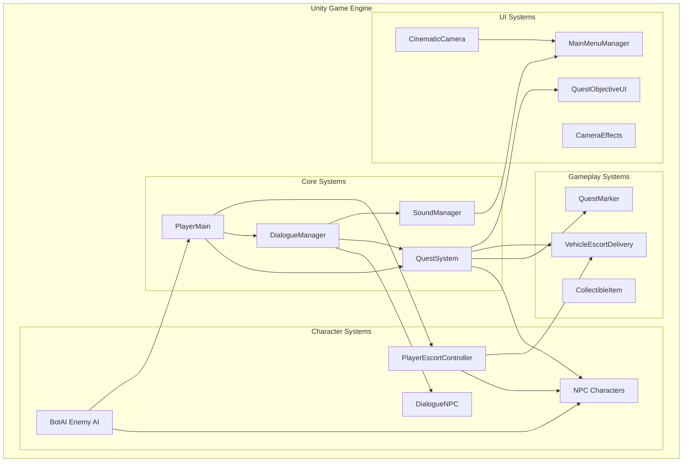

---

## 🔄 Ana Oyun Döngüsü (Main Game Loop)

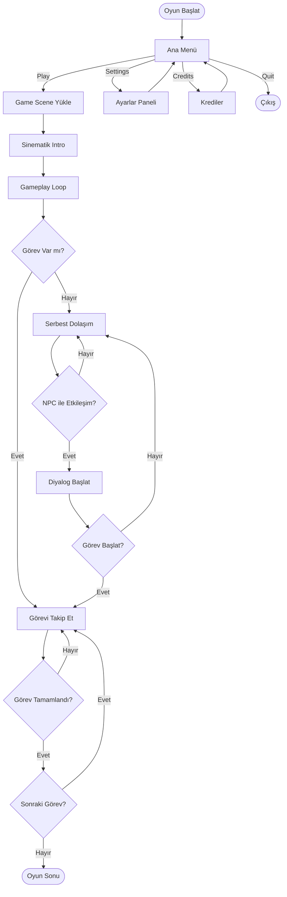

---

## 🎯 Görev Sistemi (Quest System) Flowchart

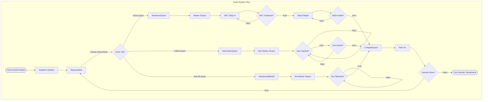

---

## 💬 Diyalog Sistemi (Dialogue System) Flowchart

```mermaid
flowchart TD
    subgraph "Dialogue System Flow"
        DS_START([Diyalog Başlat]) --> DS_CHECK{NPC Yakın mı?}
        
        DS_CHECK --> |Hayır| DS_END([Diyalog Yok])
        DS_CHECK --> |Evet| DS_INTERACT["E Tuşuna Bas"]
        
        DS_INTERACT --> DS_INIT[DialogueManager.StartDialogue]
        DS_INIT --> DS_LOCK[Player Controls Lock]
        DS_LOCK --> DS_SHOW[ShowDialogueNode]
        
        DS_SHOW --> DS_TYPE{Typewriter Effect?}
        DS_TYPE --> |Evet| DS_TYPEWRITER[Yazı Animasyonu]
        DS_TYPE --> |Hayır| DS_TEXT[Metin Göster]
        
        DS_TYPEWRITER --> DS_CHOICES
        DS_TEXT --> DS_CHOICES
        
        DS_CHOICES{Seçenek Var mı?}
        DS_CHOICES --> |Evet| DS_SHOW_CHOICES[ShowChoices]
        DS_CHOICES --> |Hayır| DS_CONTINUE[Devam Et]
        
        DS_SHOW_CHOICES --> DS_SELECT[Seçim Yap]
        DS_SELECT --> DS_NEXT_NODE[GoToNextNode]
        
        DS_CONTINUE --> DS_NEXT_NODE
        
        DS_NEXT_NODE --> DS_CHECK_END{Diyalog Bitti?}
        DS_CHECK_END --> |Hayır| DS_SHOW
        DS_CHECK_END --> |Evet| DS_END_DIALOGUE[EndDialogue]
        
        DS_END_DIALOGUE --> DS_UNLOCK[Player Controls Unlock]
        DS_UNLOCK --> DS_QUEST{Görev Başlat?}
        DS_QUEST --> |Evet| DS_START_QUEST[StartQuestFromDialogue]
        DS_QUEST --> |Hayır| DS_FINISH([Diyalog Tamamlandı])
        DS_START_QUEST --> DS_FINISH
    end
```

---

## 🤖 Bot AI Sistemi Flowchart

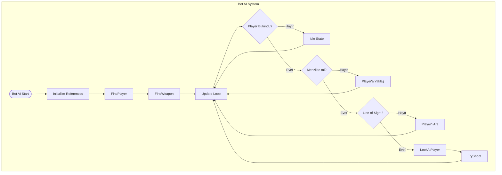

---

## 🚗 Eskort ve Teslim Sistemi Flowchart

```mermaid
flowchart TD
    subgraph "Vehicle Escort & Delivery System"
        VE_START([Eskort Başlat]) --> VE_ARREST[NPC Tutukla]
        
        VE_ARREST --> VE_FOLLOW[NPC Takip Ediyor]
        VE_FOLLOW --> VE_VEHICLE{Araca Ulaşıldı?}
        
        VE_VEHICLE --> |Hayır| VE_FOLLOW
        VE_VEHICLE --> |Evet| VE_ZONE[Delivery Zone'a Gir]
        
        VE_ZONE --> VE_TRIGGER[OnTriggerEnter]
        VE_TRIGGER --> VE_PROMPT["F Tuşuna Bas Göster"]
        
        VE_PROMPT --> VE_DELIVER{F Tuşuna Basıldı?}
        VE_DELIVER --> |Hayır| VE_WAIT[Bekle]
        VE_WAIT --> VE_DELIVER
        
        VE_DELIVER --> |Evet| VE_PROCESS[DeliverSuspect]
        VE_PROCESS --> VE_STOP[StopEscort]
        VE_STOP --> VE_COMPLETE_QUEST[Quest Complete]
        VE_COMPLETE_QUEST --> VE_SCREEN[Başarı Ekranı]
        VE_SCREEN --> VE_DESTROY[NPC Destroy]
        VE_DESTROY --> VE_NEXT{Sonraki Göreve Geç?}
        VE_NEXT --> |Evet| VE_NEXT_QUEST[OnQuestCompleted]
        VE_NEXT --> |Hayır| VE_END([Teslim Tamamlandı])
        VE_NEXT_QUEST --> VE_END
    end
```

---

## 🎵 Ses Sistemi (Sound System) Diyagramı

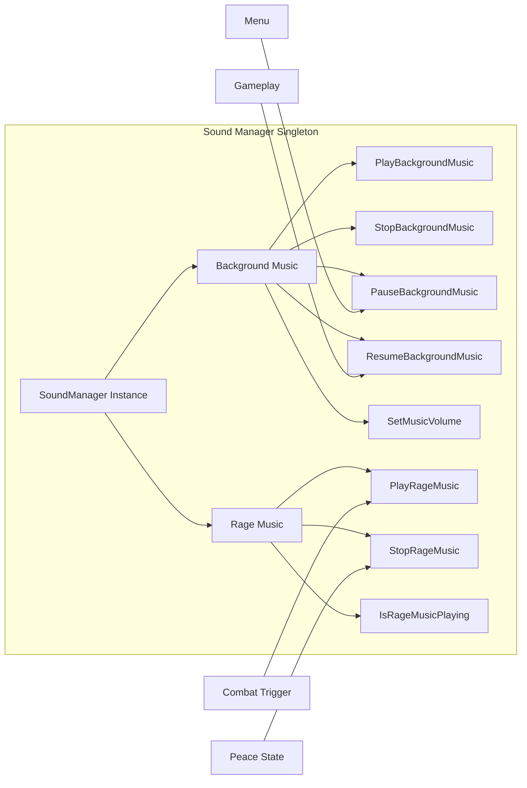

---

## 🎮 Player Controller Yapısı

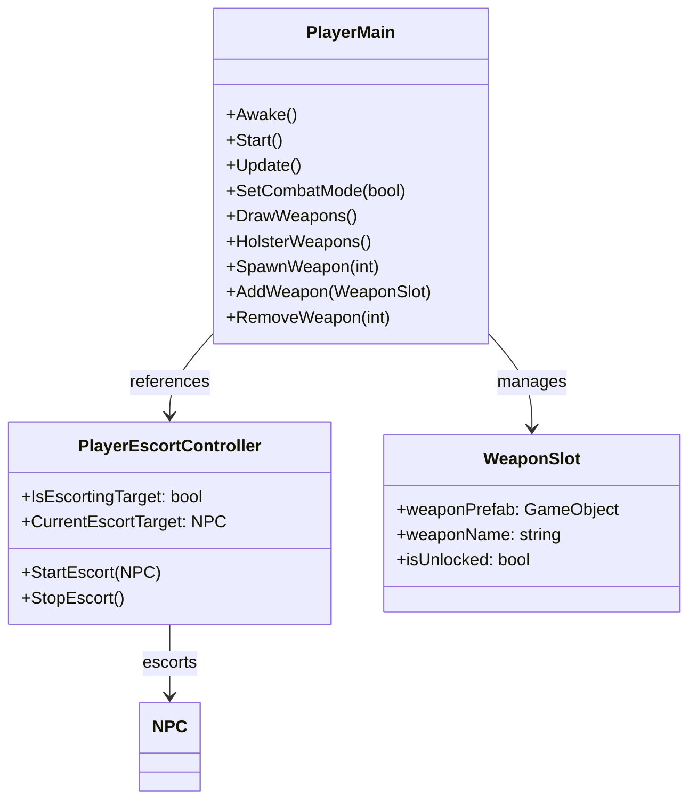

---

## 📁 Proje Klasör Yapısı

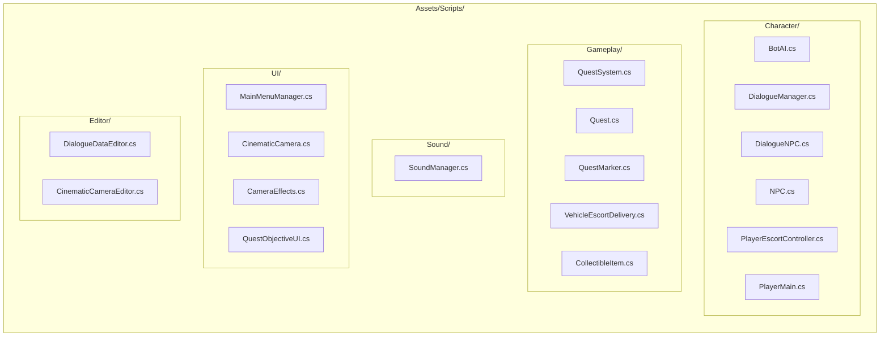

---

## 🔗 Sistem Bağımlılıkları (Dependencies)

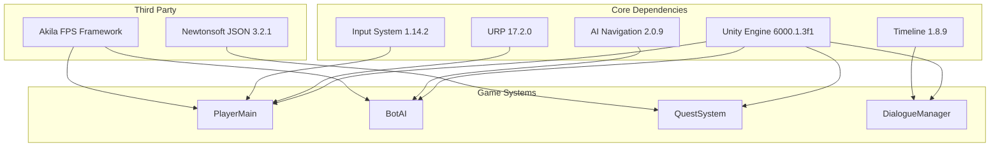

---

## 🎯 Görev Tipleri ve Durumları

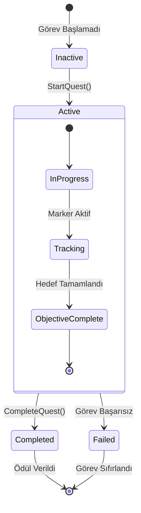

---

## 📊 NPC State Machine

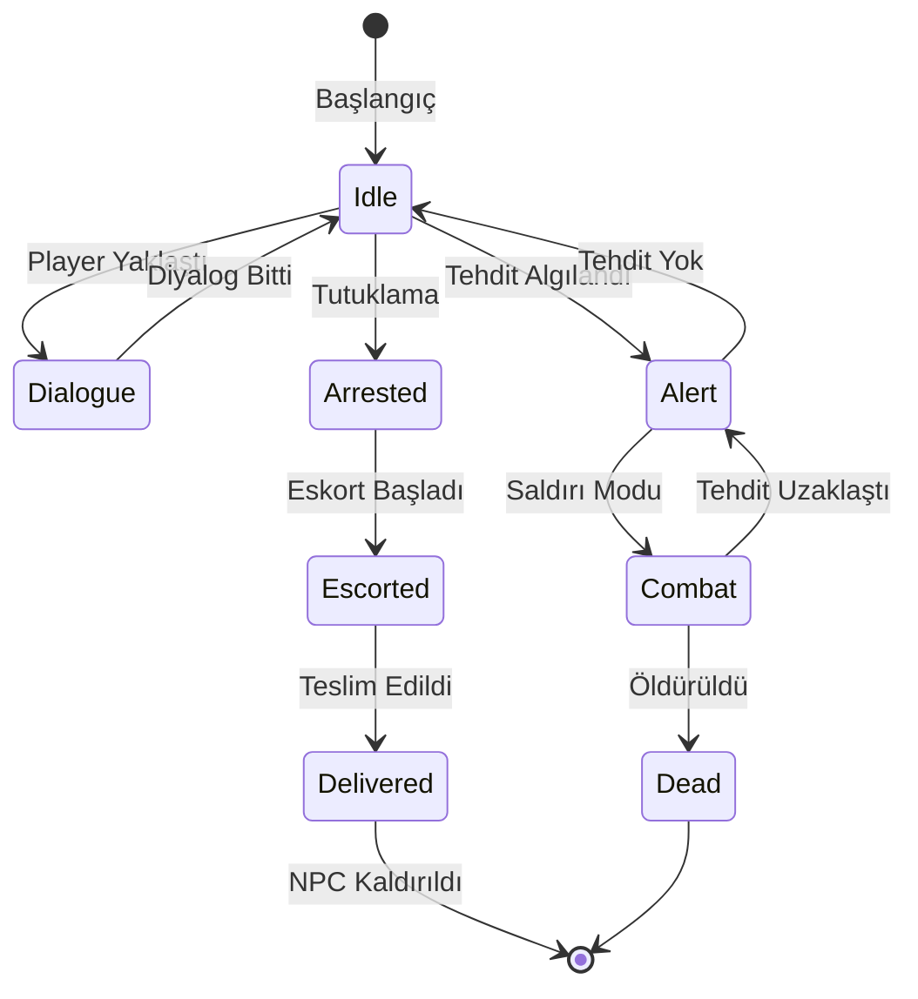

---

## 🎬 Sinematik Kamera Sistemi

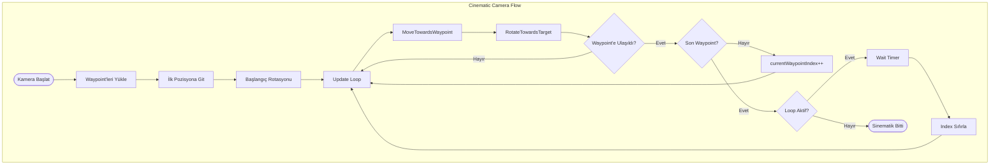

---

## 📋 Script Dosyaları Özeti

| Kategori | Dosya | Açıklama |
|----------|-------|----------|
| **Character** | `PlayerMain.cs` | Ana oyuncu controller |
| **Character** | `BotAI.cs` | Düşman AI sistemi |
| **Character** | `NPC.cs` | NPC temel sınıfı |
| **Character** | `DialogueManager.cs` | Diyalog yönetimi |
| **Character** | `DialogueNPC.cs` | Diyalog yapan NPC |
| **Character** | `PlayerEscortController.cs` | Eskort sistemi |
| **Gameplay** | `QuestSystem.cs` | Görev yönetimi |
| **Gameplay** | `Quest.cs` | Görev veri yapısı |
| **Gameplay** | `QuestMarker.cs` | Görev işaretleyici |
| **Gameplay** | `VehicleEscortDelivery.cs` | Araç teslim sistemi |
| **Gameplay** | `CollectibleItem.cs` | Toplanabilir item |
| **Sound** | `SoundManager.cs` | Ses yönetimi (Singleton) |
| **UI** | `MainMenuManager.cs` | Ana menü yönetimi |
| **UI** | `CinematicCamera.cs` | Sinematik kamera |
| **UI** | `CameraEffects.cs` | Kamera efektleri |
| **UI** | `QuestObjectiveUI.cs` | Görev UI |

---

## 🔧 Framework Özellikleri

### Singleton Pattern Kullanımı
- `QuestSystem.Instance` - Görev sistemi
- `DialogueManager.Instance` - Diyalog yönetimi
- `SoundManager.Instance` - Ses yönetimi

### Event-Driven Mimari
- Görev tamamlama eventleri
- Diyalog başlangıç/bitiş eventleri
- NPC durum değişikliği eventleri

### Component-Based Design
- Modüler script yapısı
- Tekrar kullanılabilir bileşenler
- Bağımsız sistemler

---

**Guard Simulator - Modüler ve Ölçeklenebilir Oyun Mimarisi** 🏗️

